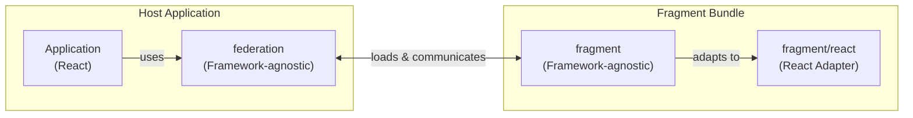
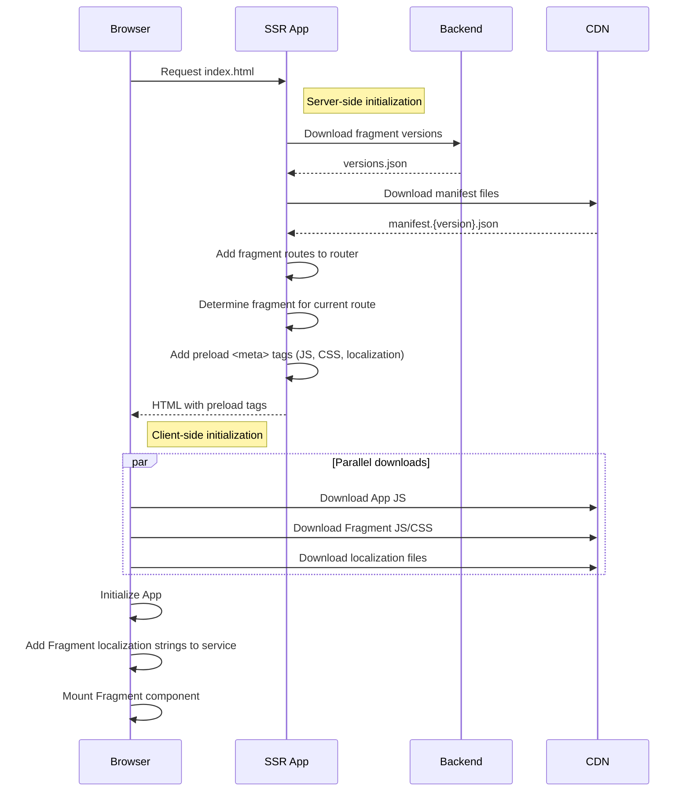
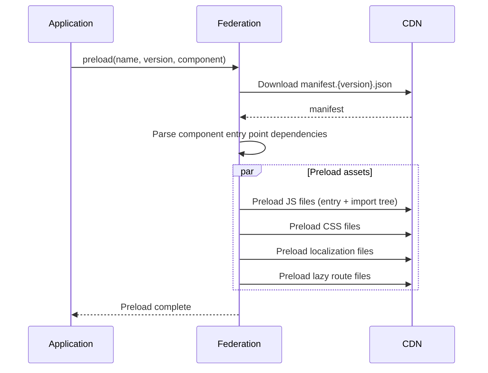
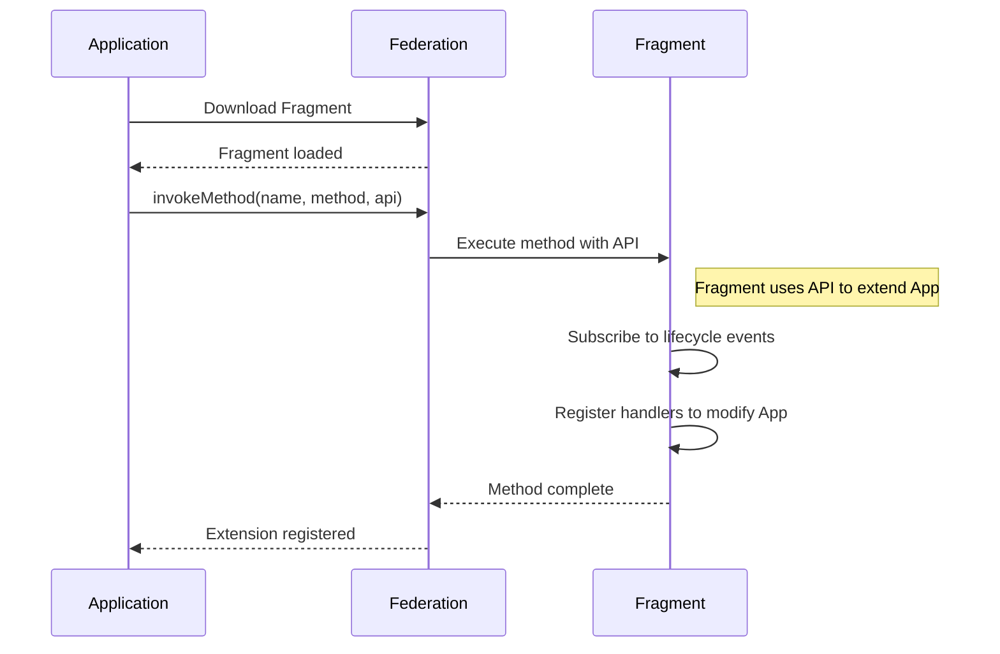

# Introduction

The Fragment system is a micro-frontend architecture that enables teams to develop, deploy, and maintain independent pieces of the application separately. Instead of building one monolithic frontend, the application is composed of multiple Fragments, each owned by different teams and deployed on their own schedules.

## What problems does it solve?

- **Independent deployments** - Teams can deploy their Fragments without coordinating with other teams or waiting for a full application release. This reduces deployment bottlenecks and enables faster iteration.
- **Team autonomy** - Each team owns their Fragment end-to-end, from development to production. Teams can make decisions about their codebase without affecting others.
- **Code isolation** - Fragments are isolated from each other, preventing unintended side effects. CSS styles, global state, and dependencies don't leak between Fragments.
- **Scalable development** - As the application grows, new features can be added as new Fragments without increasing the complexity of existing code.
- **Technology flexibility** - While the core is framework-agnostic, different Fragments could potentially use different versions of frameworks or even different frameworks entirely (with appropriate adapters).


# Glossary

- `Federation` - A service that runs in the root application (also called the "host application") and is responsible for loading, initializing, and managing Fragments. It handles versioning, routing, preloading of assets, and provides a set of interfaces that Fragments can use to interact with the host application. Think of it as the "orchestrator" that coordinates all the micro-frontends.

- `Fragment` - A self-contained, independently deployable unit of UI functionality (micro-frontend) that is built specifically to be consumed by Federation. Each Fragment can contain components, methods, routes, and translations. For example, a "User Settings" Fragment might include a settings page component, several sub-routes for different settings categories, and its own translation files.

- `Manifest` - A JSON file (`manifest.{version}.json`) that describes a Fragment's contents and structure. Federation reads this file to understand what components, methods, routes, and translations the Fragment provides, and how to load them.

- `Entry Point` - A JavaScript file that serves as the main access point for a Fragment. A Fragment can have multiple entry points, each exposing different components and methods. For example, a Fragment might have a `main` entry point for the full UI and a `widget` entry point for an embeddable mini-version.

- `Component` - A UI element exported by a Fragment that can be rendered by the host application. Components are referenced by name and can optionally define their own routing structure.

- `Method` - A function exported by a Fragment that can be invoked by the host application. Methods allow Fragments to extend the application's functionality without rendering UI. For example, a Fragment might export a method that registers event handlers or modifies application behavior.

- `Plugin` - An extension mechanism that allows the host application to expose APIs and functionality to Fragments. Plugins provide services like routing, localization, feature flags, and network requests that Fragments can use.

- `Preloading` - The process of downloading Fragment assets (JavaScript, CSS, translations) before they are actually needed. This improves perceived performance by having resources ready when the user navigates to a Fragment.

- `Subfragment` - A Fragment that is instantiated and used by another Fragment, enabling composition of micro-frontends. For example, a "Dashboard" Fragment might embed a "Charts" Fragment within itself.

- `SSR (Server-Side Rendering)` - The process of rendering the initial HTML on the server before sending it to the browser. In the Fragment system, SSR is used to add preload hints and prepare Fragment routes before the page loads.

- `CDN (Content Delivery Network)` - A distributed network of servers that hosts and delivers Fragment assets (JS, CSS, translations). Fragments are deployed to the CDN, and both the server and browser download Fragment files from it.

# Principles

## Independent of parent application
The Fragment system is designed to have no direct knowledge of the parent application it runs in. This decoupling ensures that Fragments can be reused across different host applications. Any integration with the parent application is achieved through the plugin API, which allows the host to extend Federation's capabilities and expose custom functionality to Fragments.

## Federation owns implementation, Fragments follow interface
Federation exists as a single instance in the root application and owns all core implementations. Fragments (which can have multiple instances) do not implement their own services but instead consume the interfaces provided by Federation. This ensures consistency across all Fragments and follows the principle of one service per concern: there is one service for backend requests, one for localization, one for feature flags, one for routing, and so on.

## Framework-agnostic core
The core services of both Federation and Fragment packages are framework-agnostic, meaning they don't depend on any specific UI framework like React or Vue. Framework-specific adapters are created as separate packages to bridge the gap between the framework-agnostic core and the actual UI framework being used.

# System overview

## Core packages
- `common` - Contains shared TypeScript types and interfaces used by both `federation` and `fragment` packages to ensure type safety across the system.
- `federation` - The main package installed in the root application. It provides all the functionality needed to load, manage, and communicate with Fragments.
- `fragment` - The package that each Fragment uses to interact with Federation. It provides APIs for registering components, methods, and accessing Federation services.
- `fragment/react` - A React-specific adapter for the `fragment` package. It converts framework-agnostic data into React primitives like props and hooks.
- `fragment-tests/react` - Testing utilities for Fragments that include mocks for Federation interfaces and helpers for setting up test environments.

## Architecture diagram

The following diagram shows how the packages relate to each other and how data flows through the system:



## Application initialization flow

The following diagram shows the sequence of events when a user requests a page that uses Fragments:



# Federation

## Responsibilities

Federation is responsible for the following core functions:

1. **Version management** - Tracking and setting which version of each Fragment should be loaded.
2. **Preloading** - Loading Fragment assets (JS, CSS, localization files) by name and version before they are needed, including assets for specific routes.
3. **Fragment service creation** - Instantiating Fragment services that provide access to components and methods exported by the Fragment.
4. **Component service** - Managing the lifecycle of Fragment components including mounting, unmounting, and passing properties to them.
5. **Method service** - Providing the ability to invoke methods exported by Fragments.
6. **Subfragment tree management** - Managing nested Fragments when one Fragment needs to instantiate and use another Fragment.
7. **Plugin API** - Allowing the host application to extend Federation's functionality and expose custom APIs to Fragments.

## Versioning
Federation maintains a registry of Fragment versions. When a Fragment is requested by name, Federation uses this registry to determine which version to load.

## Preloading
Federation can preload Fragment assets before they are actually needed. This includes JavaScript bundles, CSS files, dynamic route files, and localization files. Preloading is done by specifying the Fragment name and version, and Federation will fetch all necessary assets in the background.



## Component mounting
Federation handles the mounting and unmounting of Fragment components into the DOM. This includes injecting the Fragment's styles, applying style scoping to prevent CSS conflicts, and passing properties from the host application to the Fragment component.

## Method invocation
Fragments can export methods that can be called by the host application. Federation provides an API to invoke these methods by specifying the Fragment name and method name.

## Subfragments
Federation provides an API that allows Fragments to instantiate and use other Fragments. This enables composition of micro-frontends where one Fragment can embed another Fragment within itself.

## Plugins

Plugins extend Federation's functionality and expose APIs to Fragments. The following plugins are available:

- **router** - Manages the base path for Fragment routes, provides custom route resolvers, synchronizes the Fragment's router with the host application's router, and exposes a routing API for Fragments to navigate and read route information.
- **feature flags** - Allows the host application to set feature flags that Fragments can read. Exposes an API for Fragments to check flag values.
- **localization** - Handles preloading of translation files, registers Fragment translation strings with the localization system, and exposes an API for Fragments to access translated strings.
- **color scheme** - Manages the application's color scheme (light/dark mode) and exposes an API for Fragments to read and react to scheme changes.
- **network** - Exposes a network request API that Fragments can use to make HTTP requests. This ensures consistent request handling across all Fragments.
- **logger** - Exposes a logging API that Fragments can use for consistent logging across the application.
- **root data** - Exposes data from the root application to Fragments, such as current user information, permissions, and other application-level data.
- **root handlers** - Exposes functions from the root application that Fragments can call, enabling Fragments to trigger actions in the host application.
- **root storage** - Exposes a persistent storage API to Fragments. Data stored through this API persists even after the Fragment is unloaded, allowing Fragments to maintain state across sessions.

### Plugin example
```ts
// defining a federation plugin
export default createFederationPlugin('dataLake', (context) => {
  // add hooks to extend the system. in this example we hook into component creation process
  context.hook('component:create', onComponentCreate);

  function onComponentCreate(component: InternalFragmentComponentService) {
    // add "dataLake" to component context, so component can access "dataLake" api
    component.context.dataLake = {
      // component can call "logEvent" function
      logEvent(eventOptions: DataLakeEventRecord) {
        // logic to set event to data lake
      },
    };
  }
});
```

# Fragment

## Build process
Fragments are built using the `fragment()` Vite plugin. This plugin configures the Vite build process specifically for Fragment development and production builds. It handles code splitting, asset optimization, manifest generation, and sets up the development server for local Fragment development.

## Bundle structure
When a Fragment is built, it produces the following output structure:

- `{entryName}.{version}.js` - The main entry point JavaScript file. A Fragment can have multiple entry points, each producing its own file.
- `assets/` - Directory containing static assets including images, additional JavaScript chunks, and CSS files.
- `assets/translations/` - Directory containing JSON translation files for each supported locale.
- `manifest.{version}.json` - A JSON file containing metadata about the Fragment that Federation uses for loading and configuration.

## Manifest
The manifest is a JSON file that describes the Fragment and its contents. Federation reads this manifest to understand what the Fragment provides and how to load it. The manifest includes information about entry points, components, methods, routes, translations, and feature flags.

Structure:

```ts
type FragmentManifest = {
  // Unique identifier for the Fragment, used by Federation to reference it
  name: string;
  // Version string, typically in format `{branch}.{hash}` for commit-based builds
  version: string;
  // Map of static assets and their dependencies, generated by Vite
  artifacts: ViteManifest;
  // Optional array of translation file configurations
  translations?: FragmentManifestTranslations;
  // Array of entry points that this Fragment exposes
  entries: FragmentManifestEntry[];
  // Array of feature flags that this Fragment uses
  featureFlags: FragmentManifestFeatureFlag[];
};

/**
 * Represents an entry point of the Fragment.
 * Each entry point can export multiple components and methods.
 */
type FragmentManifestEntry = {
  // Name of the entry, corresponds to the {entryName} part of the entry file
  name: string;
  // Components exported from this entry point
  components: FragmentManifestComponent[];
  // Methods exported from this entry point
  methods: FragmentManifestMethod[];
};

/**
 * Represents a component exported from an entry point.
 * Components can optionally define their own routing structure.
 */
type FragmentManifestComponent = {
  // Name of the component, used to reference it when mounting
  name: string;
  // Optional routing structure for this component
  routes?: FragmentRouteRecord[];
};

/**
 * Represents a method exported from an entry point.
 * Methods can be invoked by the host application or other Fragments.
 */
type FragmentManifestMethod = {
  // Name of the method, used to reference it when invoking
  name: string;
};

/**
 * Represents a route record for a component.
 * Defines the routing structure that the component handles.
 */
type FragmentRouteRecord = {
  // Route path, will be prefixed with Federation's `base` path when used in browser
  path: string;
  // Optional metadata for the route, can be used by Federation for layout decisions
  // Example: { layout: 'fullscreen' } to render the route without the standard page layout
  meta?: Record<string, boolean | string | number | undefined | null>;
  // Optional file path for dynamic import, used for preloading route-specific code
  file?: string;
  // Optional nested routes
  children?: FragmentRouteRecord[];
};

/**
 * Configuration for a translation file.
 * Tells Federation where to find translations for a specific locale.
 */
type FragmentManifestTranslations = {
  // Locale code, e.g., `en-US`, `de-DE`
  locale: string;
  // Path to the JSON file containing translations
  file: string;
  // Optional namespace to scope translations and avoid conflicts
  namespace?: string;
}[];
```

## Methods

Methods are functions exported by a Fragment that can be invoked by the host application. They serve as "extensions" that allow Fragments to extend the Application's functionality. When a method is invoked, the Application passes an API object that the Fragment can use to subscribe to lifecycle events, modify application behavior, or register handlers.



Example(Defining a method in Fragment):
```ts
// define method with name "learnerPublic"
export default defineFragmentMethod('learnerPublic').callback(
  // fragment - api from federation system. cloud - custom prop from a host application. In this case - API to extend Constructor's host app - `Cloud` 
  (fragment, cloud: CloudExtensionContext) => {
    // here is registration of some hook to modify sign in url
    cloud.hook('buildSignInUrl', (options) => {
      if (options.type !== 'fragment' || options.fragmentName !== 'learner-app') {
        return;
      }

      // using some host application's methods
      const redirectUrl = cloud.getFragmentUrl({
        fragmentName: 'learner-app',
        fragmentComponent: 'learnerMain',
        fragmentPathname: '/courses',
      });

      return { redirectUrl };
    });
  },
);
```

## Components

Components are UI elements exported by a Fragment with specific names. The Application can render these components by referencing their names.

Examples of how the Application can determine which component to render:
- **Hardcoded names** - The Application uses predefined component names that are known at build time.
- **Backend-driven names** - The Application requests the component name from the backend, allowing dynamic selection of which component to render.

Defining a component in Fragment:
```ts
import { defineFragmentComponent } from '@constructor/fragment';
import {
  fragmentVuePlugin,
  fragmentVueDefaultPresetPlugin,
  fragmentVueRouterPlugin,
  fragmentVueLocalizationPlugin,
} from '@constructor/fragment/vue';
import { createPinia } from 'pinia';
import { routes } from './learnerPublic.routes';
import PublicEntry from './LearnerPublic.vue';

// define fragment component with name "learnerPublic"
export default defineFragmentComponent('learnerPublic').plugins(
  // plugins are framework-specific and provides access to framework-agnostic Federation APIs
  fragmentVuePlugin(PublicEntry, {
    plugins: [createPinia()],
  }),
  fragmentVueRouterPlugin({ routes }),
  fragmentVueLocalizationPlugin(),
  fragmentVueDefaultPresetPlugin(),
);

```
